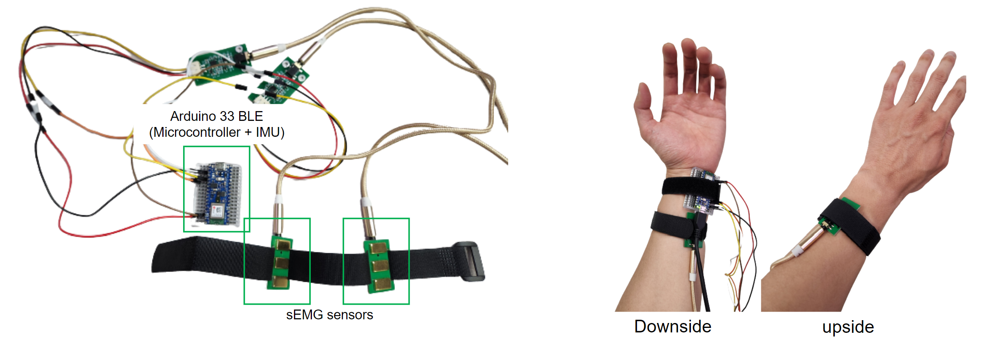
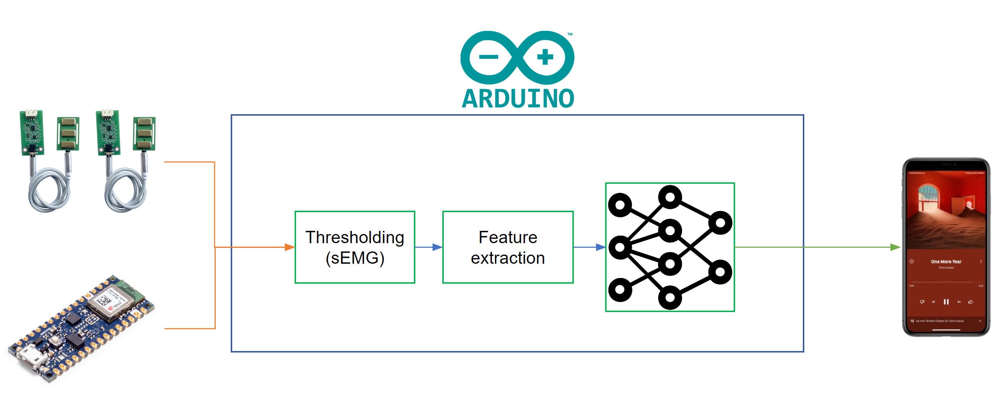

# Gestural Control of Music Player App for Runners
### CS565-23S IoT Data Science Mini-Project
### Yohan Lee (20223488)

---

## 1. Introduction

### 1-1. Project Background
Gesture estimation, a research topic in Human-Computer Interaction, seeks to distinguish the gestures of a person's fingers, arms, or entire body using real-time sensor data, with applications ranging from monitoring elderly falls to identifying specific exercises. As running grows increasingly popular, with people forming "crews" for regular runs and often listening to music as a distraction, controlling music players can present a challenge. Traditional control methods via touchscreen, earphone buttons, or voice assistants like Siri or Bixby can be impractical or limited, particularly during physical exertion like running.  

Therefore, this project proposes a gestural control system for music players suited for runners. The system, intuitive and functional even with sweaty hands, bypasses the constraints of static gesture estimation, utilizing IMU sensors to adapt to the dynamic conditions of running.

### 1-2. Project Overview
This project, "Gestural Control of Music Players For Runners" is designed to utilize gesture estimation techniques to provide an intuitive method of controlling music players, even in the dynamic environment of running. It uses a 6-DoF IMU (accelerometer and gyroscope) and two sEMG sensors to capture acceleration, angular velocity, and muscle response or electrical activity at the wrist of a user, and estimate different gestures and use it to control a music player app. It uses EMG sensor readings that are robust to the movement while running as a trigger to detect if the current motion is controlling the gesture or not. 

## 2. Repo explanation
### 2-1. Hardware Requirements
To run this project, you need to have the following hardware:
- Arduino Nano 33 BLE Sense
- 2x sEMG sensors (I used [this](https://www.devicemart.co.kr/goods/view?no=15019582))
- and some jumper cables and a breadboard.
  
### 2-2. File Structure

#### 2-2-1. ArduinoDataCollecting/
- ArduinoDataCollecting.ino: Arduino code for collecting data from IMU and sEMG sensors
- EMGFilters.h: Arduino library for filtering EMG signals
- EMGFilters.cpp: Arduino library for filtering EMG signals

#### 2-2-2. ArduinoClassifierBLE/
- ArduinoClassifierBLE.ino: Arduino sketch for classifying gestures using IMU and sEMG sensors. This sketch allows the Arduino to communicate with the computer or smartphone via BLE.
- model_quant.h: Quantized version of TensorFlow Lite model for gesture classification
- EMGFilters.h: Arduino library for filtering EMG signals
- EMGFilters.cpp: Arduino library for filtering EMG signals

#### 2-2-3. ArduinoClassifierNoBLE/
- ArduinoClassifierNoBLE.ino: Arduino sketch for classifying gestures using IMU and sEMG sensors. This sketch allows the Arduino to communicate with the computer or smartphone via serial communication.
- model_quant.h: Quantized version of TensorFlow Lite model for gesture classification
- EMGFilters.h: Arduino library for filtering EMG signals
- EMGFilters.cpp: Arduino library for filtering EMG signals

#### 2-2-4. AndroidSpotifyBLE_incomplete/
This folder contains the Android Studio project for the Android app that controls Spotify via BLE. 
This app is based on the [Spotify Android SDK](https://developer.spotify.com/documentation/android/quick-start/), and is not complete yet. If the right BLE device is nearby, it can connect to the device and receive a message (gesture detected) from Arduino. However, the mapping from gesture to control is not defined yet.

#### 2-2-5. ModelTraning.ipynb
This notebook contains the code for training the gesture classification model. It uses the custom dataset made by Yohan Lee [(link)](https://drive.google.com/drive/folders/16d5pDU4xogypuykvdfhFnsdtEDE1yu9m?usp=sharing). The model is trained using TensorFlow and converted to TensorFlow Lite for deployment on Arduino.